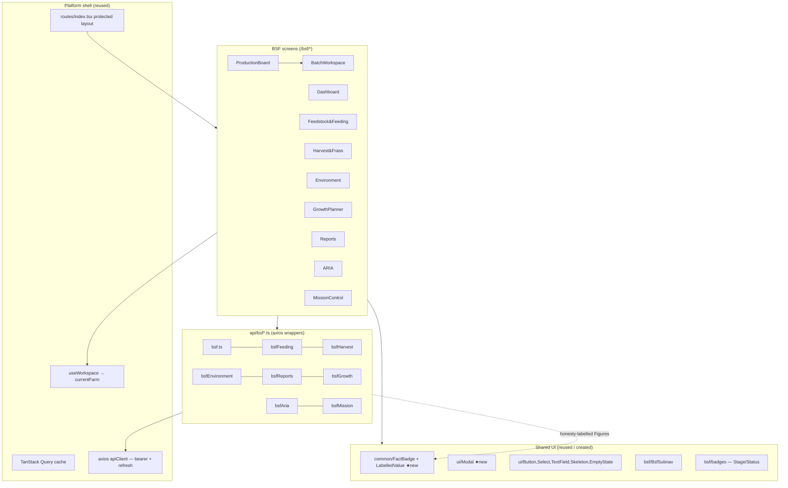

# Module 16 — Black Soldier Fly (BSF): Frontend Handoff Package

**Canonical frontend reference.** Read this to understand, extend, or maintain the
Module 16 frontend. It pairs with the backend handoff
([`MODULE_16_BSF_HANDOFF.md`](MODULE_16_BSF_HANDOFF.md)) and the per-milestone build
history ([`MODULE_16_BSF_LEDGER.md`](MODULE_16_BSF_LEDGER.md)).

- **Status:** Complete — all 10 screens built and browser-verified end-to-end.
- **Branch:** `phase-2-auth` (local commits `e80b22c … 67866e1`, **unpushed**).
- **Stack:** React 18 + TypeScript + Vite 6 + React Router v6 + TanStack Query v5 +
  axios + Tailwind. Template = the Aviculture module.

---

## 1. Overview & principles

The frontend is **presentation, interaction, navigation, client state, a11y,
responsive layout and loading/error handling — nothing more.** It consumes the
stable backend APIs and **never** recomputes calculations, validations, forecasts,
analytics or business rules. Four principles are visible in every screen:

1. **Deterministic-first** — all numbers come from the backend engines.
2. **Honesty framework, made visible** — every computed value renders with a
   `FactBadge` (`recorded` · `calculated` · `forecast` · `estimate` · `unknown` ·
   `unavailable`) and the engine's `detail` as a tooltip. Recorded facts, derived
   calculations, projections and assumption-based estimates stay **visually
   distinct**.
3. **ARIA is advisory** — the ARIA and Mission Control screens are strictly
   read-only; no screen path mutates a plan through them.
4. **Explicit user action** — every create/modify is a deliberate modal/dropdown
   action; errors surface the backend's message.

---

## 2. Architecture diagram



`★new` = reusable additions this module contributed to the shared kit.

---

## 3. Component hierarchy

```
routes/index.tsx (protected layout)
└── /bsf/*  (lazy-loaded screens, each renders <BsfSubnav active=…>)
    ├── ProductionBoardScreen        — BatchCard[] · NewBatchModal
    ├── BatchWorkspaceScreen         — BatchView (MetricTile[], history, timeline) · ActionModals(advance/move/split/terminate)
    ├── BsfDashboardScreen           — Section[] (ScoreTile[], Tile[], ForecastTile[], BottleneckRow[])
    ├── BsfFeedstockScreen           — LotCard[] · AddLotModal · RecordFeedingModal
    ├── BsfHarvestScreen             — readiness panel · harvest/frass history · HarvestFrassModal
    ├── BsfEnvironmentScreen         — AssessmentGrid · readings table · AddUnitModal · RecordReadingModal
    ├── BsfGrowthScreen              — PlanView (goal cards, MilestoneRow[], revisions) · NewPlanModal
    ├── BsfReportsScreen             — ForecastCard[] · SusTile[] · BottleneckRow[] · CSV export
    ├── BsfAriaScreen                — chat thread (Turn[]) · suggestion chips · FactBadge on answers
    └── BsfMissionScreen             — headline · priorities · InsightRow[] (evidence badges)
Shared: components/common/FactBadge (FactBadge, LabelledValue) · components/ui/Modal
        screens/bsf/BsfSubnav · screens/bsf/badges (StageBadge, BatchStatusBadge)
```

---

## 4. Routing (all under the authenticated layout in `routes/index.tsx`)

| Path | Screen | Notes |
|---|---|---|
| `/bsf` | Production Board | landing; cards link to the workspace |
| `/bsf/batches/:batchId` | Batch Workspace | lifecycle actions |
| `/bsf/dashboard` | Executive Dashboard | read-only |
| `/bsf/feedstock` | Feedstock & Feeding | lots + feeding + post-to-ledger |
| `/bsf/harvest` | Harvest & Frass | batch-scoped |
| `/bsf/environment` | Environment | unit-scoped + Add-unit |
| `/bsf/growth` | Growth Planner | plans/goals/milestones/revisions |
| `/bsf/reports` | Reports & Analytics | forecast/sustainability/bottlenecks/CSV |
| `/bsf/aria` | Ask ARIA | advisory chat |
| `/bsf/mission` | Mission Control | briefing |

Lazy-loaded via `React.lazy`. Intra-module navigation is the `BsfSubnav` tab bar.
The frontend has **no client-side RBAC layer** (the platform pattern) — it relies
on backend 403s surfaced as error states.

---

## 5. API consumption map

| Screen | `api/*` module | Endpoints |
|---|---|---|
| Production Board | `bsf.ts` | `GET/POST /bsf/batches` (+ species/units/colonies) |
| Batch Workspace | `bsf.ts` | `GET /batches/{id}`, `/lifecycle`, `/timeline`; `POST /advance /move /split /terminate` |
| Dashboard | `bsfReports.ts` | `GET /reports/dashboard` |
| Feedstock & Feeding | `bsfFeeding.ts` | feedstock-lots CRUD; `POST /batches/{id}/feedings`; `POST /feedstock-lots/{id}/post-expense` |
| Harvest & Frass | `bsfHarvest.ts` + `inventory.ts` | harvest-readiness; `POST/GET harvests`, `frass`; reuses `listInvItems` |
| Environment | `bsfEnvironment.ts` + `bsf.ts` | `GET/POST /environment/readings`, `/units/{id}/assessment`; reuses `createUnit`/`listUnits` |
| Growth Planner | `bsfGrowth.ts` | plans CRUD, `PATCH milestones/{id}`, `revisions` |
| Reports | `bsfReports.ts` | `/reports/forecast`, `/bottlenecks`, `/dashboard`, `/production.csv` (blob) |
| ARIA | `bsfAria.ts` | `POST /aria/ask`, `GET /aria/context` |
| Mission Control | `bsfMission.ts` | `GET /mission/bsf/briefing` |

**Conventions:** every wrapper returns `data.data` from the `{success,data,meta}`
envelope; queries key on `["bsf-…", farmId, …]` and gate on `enabled: !!farmId`;
mutations `invalidateQueries` the affected keys; CSV uses `responseType:"blob"` (an
authenticated download, never a plain `<a href>` which would 401).

---

## 6. Reusable UI patterns (created for the platform)

1. **`components/common/FactBadge.tsx`** — the canonical honesty renderer. `FactBadge`
   (colour + tooltip per label) and `LabelledValue` (`{label,value,detail}` → value +
   badge). **Every future module should render engine figures through these** so
   honesty is consistent platform-wide. Adds `estimate` (amber) over the older
   aviculture-local copy.
2. **`components/ui/Modal.tsx`** — accessible dialog (focus-trap, Esc, backdrop
   close, bottom-sheet on mobile) the shared kit lacked. Use for all module forms.
3. **`BsfSubnav`** — the per-module tab bar pattern (mirror `AviSubnav`).
4. **Screen skeleton** — header + subnav + `isError`/`isLoading`(Skeleton)/`empty`
   (EmptyState)/`data` branches; farm from `useWorkspace`; create/act via `Modal`.
   Copy any BSF screen as a starting point.

---

## 7. Verification results

- **Type-check:** `npm run type-check` (tsc) — clean after every milestone.
- **Build:** `npm run build` (vite) — succeeds (exit 0) after every milestone; PWA
  precache regenerated.
- **Lint:** repo-wide ESLint is **broken** (v9 needs `eslint.config.js`; only legacy
  `.eslintrc` exists) — a **pre-existing** repo issue, confirmed on `/aviculture` too.
  Per project convention the frontend gate is **tsc + vite build**.
- **Browser (end-to-end, real backend on :8000 + local Postgres :5433, demo login):**
  each screen was driven live. Highlights:
  - Production Board — created a batch → backend `BSF-00001` → card rendered.
  - Batch Workspace — honesty labels distinct; **Advance** offered forward-only
    stages → Egg → Hatchling (backend-validated) → refetch.
  - Dashboard — scores Calculated/Unknown/**Unavailable**(growth) correctly.
  - Feedstock — feeding decremented a lot 100→70 kg (status → in use); **Post to
    ledger** → shared-ledger reuse confirmed.
  - Harvest — readiness "too early to harvest" (`calculated`); frass recorded.
  - Environment — added unit, recorded reading → live assessment (recorded/unknown).
  - Growth — plan created; goal progress from recorded facts; milestone → achieved
    (backend wrote a new revision).
  - Reports — forecast labelled **forecast** with assumptions/limitations.
  - ARIA — "70.0 kg feedstock on hand" (**recorded fact**, sourced, confidence high).
  - Mission — "Operating at a loss" citing recorded/calculated finance evidence.
  - **No console errors** on any screen.
- **Known environment quirk (not a bug):** a full-page reload of a protected route
  can stall on the app-shell auth cold-load (in-memory access token dropped →
  refresh cycle). Reproduced identically on `/aviculture`. In-SPA navigation is
  unaffected; verification used client-side navigation.

---

## 8. Remaining gaps

| Item | Notes |
|---|---|
| **Automation UI** (tasks/reminders/workflows) | Backend Automation part (P9) is itself deferred; no screen yet |
| **Batch merge in the UI** | API supported; a multi-select action belongs on the board/reports (not the single-batch workspace) |
| **Growth revision *diff* view** | `compare-revisions` API exists; the UI shows the revision list but not a visual diff |
| **Global module launcher entry** | BSF is reached via `/bsf` + subnav; not yet added to the platform's main module nav registry |
| **Per-batch feed-conversion panel** | `getFeedConversion` API exists; surfaced via Reports/dashboard, not yet on the batch workspace |
| **Frontend unit/e2e tests** | Verified via tsc + build + live browser; no vitest specs added for BSF screens yet |
| **a11y/perf audit at scale** | Focus-trap + labels + responsive grids in place; a formal Part-9 audit is pending |

None of these block use; all are additive.

---

## 9. Extension guidance — a screen for a future module

1. **API wrapper** `src/api/<module>*.ts` — thin axios functions returning `data.data`;
   type computed figures as `Figure = {label,value,detail}`.
2. **Screen** `src/screens/<module>/…Screen.tsx` — `useWorkspace()` for the farm;
   `useQuery`/`useMutation` keyed `["<module>-…", farmId]`; render the header +
   subnav + isError/isLoading/empty/data branches.
3. **Honesty** — render every engine figure via `LabelledValue`/`FactBadge`. Never
   compute or reformat a number into a different meaning.
4. **Forms/actions** — use `components/ui/Modal`; disable submit until valid; surface
   `error.response.data.error.message` on failure; `invalidateQueries` on success.
5. **Route** — add a `lazy` import + a `{path,element}` under the protected layout in
   `routes/index.tsx`; add a tab to the module's subnav.
6. **Advisory surfaces** (ARIA/Mission) — keep them read-only; show `fact_type`,
   `sources`, `confidence`, and any `limitations` verbatim.
7. **Verify** — `npm run type-check` + `npm run build`, then drive the screen in the
   browser against the running backend; confirm no console errors.

**Rule of thumb:** if the screen is deciding *what a number means* or *whether an
action is valid*, stop — that belongs in the backend engine, and the value should be
arriving honesty-labelled instead.

---

## 10. Implementation statistics

| Metric | Value |
|--------|------:|
| Frontend milestones | 10 |
| Screens | 10 (+ `BsfSubnav`, `badges`) |
| API service modules | 8 (`bsf.ts` + 7) |
| Shared components created | 2 (`FactBadge`, `Modal`) |
| Routes registered | 10 (+ `/mission/bsf/briefing` consumed) |
| Screen + API LOC | ~3,040 |
| Shared component LOC | ~170 |
| Commits (frontend) | 10 feature + 10 doc-pin, local on `phase-2-auth` |

### File index
- **Screens:** `src/screens/bsf/` — `ProductionBoardScreen`, `BatchWorkspaceScreen`,
  `BsfDashboardScreen`, `BsfFeedstockScreen`, `BsfHarvestScreen`,
  `BsfEnvironmentScreen`, `BsfGrowthScreen`, `BsfReportsScreen`, `BsfAriaScreen`,
  `BsfMissionScreen`, `BsfSubnav`, `badges`.
- **API:** `src/api/` — `bsf`, `bsfFeeding`, `bsfHarvest`, `bsfEnvironment`,
  `bsfReports`, `bsfGrowth`, `bsfAria`, `bsfMission`.
- **Shared:** `src/components/common/FactBadge.tsx`, `src/components/ui/Modal.tsx`.
- **Routing:** `src/routes/index.tsx`.
